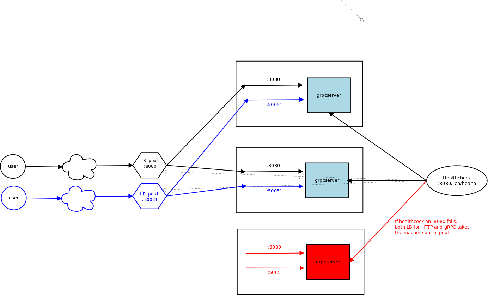
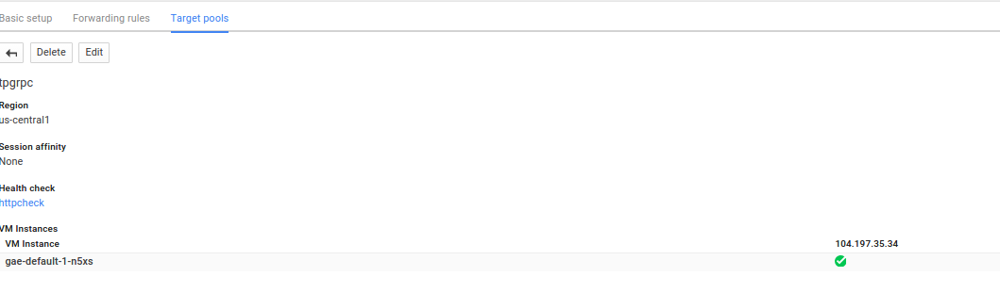
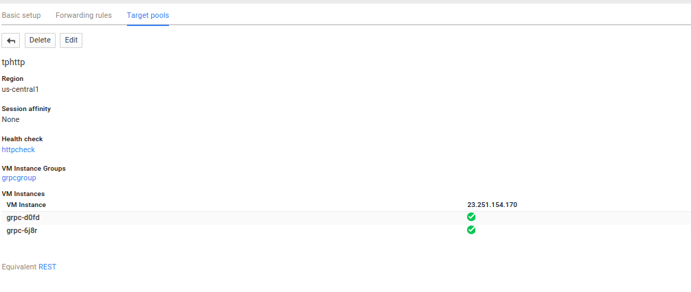

### LoadBalanced Appengine/ComputeEngine gRPC cluster


Sample code demonstrating gRPC server running in Google Appengine and on ComputeEngine in a LoadBalanced, failover config.

The gRPC client/server example is derived from:  

*  [gRPC Helloworld](https://github.com/grpc/grpc-go/tree/master/examples/helloworld)

Note:  if you intend to just communicate container->container in GCE, you may want to utilize [GKE Services](https://github.com/salrashid123/kubehelloworld) or even manually by adding in sidecar services like [etcd](https://github.com/coreos/etcd)

=====================

For more information, see:
*  [Container Optimized GCE image](https://cloud.google.com/compute/docs/containers/container_vms)
*  [gRPC](http://www.grpc.io/)
*  [Google Compute Engine Load Balancing](https://cloud.google.com/compute/docs/load-balancing/#network_load_balancing)
*  [Google Appengine Managed VM](https://cloud.google.com/appengine/docs/managed-vms/)
*  [google protobuf](https://github.com/google/protobuf)


=====================

***  

###Overview
The server part of the program is **both** an HTTP server and a gRPC server.  The HTTP server was added on to help with the GAE and GCE loadblanacer and healthchecker.

The HTTP server is configured to listen on :8080/_ah/health_

Also see:
* [GAE Healthcheck](https://cloud.google.com/appengine/docs/managed-vms/custom-runtimes#listen_to_port_8080)
* [GCE Healthcheck](https://cloud.google.com/compute/docs/load-balancing/health-checks)

 


####Build  and run gRPC client/server

The follwoing commands builds the gRPC client/server server locally.

Note:  you must have **proto3** compiled for your system first.
*  [proto3](https://github.com/google/protobuf)
  

```bash
export GOPATH=/tmp/gcegrpc/docker_image
go get golang.org/x/net/context
go get google.golang.org/grpc
go get golang.org/x/oauth2/...
go get -u github.com/golang/protobuf/{proto,protoc-gen-go}
export PATH=$PATH:`pwd`/bin
protoc --go_out=plugins=grpc:. src/echo/echo.proto

go run src/grpc_server.go 
go run src/grpc_client.go -host=localhost:50051
```

Now build the image and test running the client/server

```bash
cd docker_image
docker build -t gcpserver .
docker run -t -p 8080:8080 -p 50051:50051 gcpserver
go run src/grpc_client.go -host=localhost:50051
```
  
After that, tag the image and upload to your [docker.io](https://hub.docker.com/u/salrashid123/) repo.

```
docker tag -f gcpserver  yourdockerhub/gcpserver
docker push yourdockerhub/gcpserver
```


####Deploy gRPC and HTTP server to GAE

**NOTE**: running an LB cluster like this is of very limited use because you have manually address each node by its public IP or keep manually retargeting an unmanaged instance group.  This section was just added to demonstrate how to access a managedVM directly; nothing more.

```bash
gcloud preview app deploy app.yaml --version 1 --set-default
```

To access the server from a remote client, you will need to open up a firewall rule for :50051 to the GAE instance IP directly or manually create an unmanaged instance group with that target.  Unfortunately, at the moment, there is no way to target an LB pool with all GAE instances directly.

```
gcloud compute firewall-rules create grpc-firewall \
    --target-tags grpcserver --allow tcp:50051
```

When the managed VM is up, you can access it directly on the IP its availble at: *104.197.85.10*
 

Alternatively, you can attach the instances to an LB pool that is HTTP balanced:  In the example below, the only managedVM thats in use is *gae-default-1-n5xs*

```
gcloud compute  forwarding-rules create grpcfwd --region us-central1 \
    --ip-protocol TCP --port-range 8080-50051 --target-pool tpgrpc

gcloud compute http-health-checks create httpcheck \
    --port 8080 --request-path "/_ah/health" 

gcloud compute  target-pools create tpgrpc --health-check httpcheck \
    --region us-central1 

gcloud compute - target-pools add-instances tpgrpc --zone us-central1-f \
    --instances gae-default-1-n5xs
```

The follwoing shows the GAE instance part of a loadbalancer thts manually targeted.  The obvious problem with manually targeting a pool for managedVMs is that everytime the VM is recycled, it acquires a new name so this method is not at all feasible to implement.  It was just cited as an example.

 

####Deploy gRPC and HTTP server to GCE

```bash
gcloud compute instance-templates create grpctemplate \
    --tag grpcserver --image container-vm \
    --metadata-from-file google-container-manifest=containers.yaml \
    --machine-type f1-micro

gcloud compute firewall-rules create grpc-firewall \
    --target-tags grpcserver --allow tcp:50051

gcloud compute firewall-rules create allow-httpalt \
    --allow tcp:8080  --target-tags grpcserver

gcloud compute http-health-checks create httpcheck \
    --port 8080 --request-path "/_ah/health" 

gcloud compute  target-pools create tphttp \
    --health-check httpcheck --region us-central1

gcloud compute forwarding-rules create fwdgrpc \
    --region us-central1 --ip-protocol TCP \
    --port-range 8080-50051 --target-pool tphttp

gcloud compute instance-groups managed create grpcgroup \
    --zone us-central1-a --base-instance-name grpc \
    --size 2 --template grpctemplate \
    --target-pool tphttp

```

The following shows two instances that are part of the instance group in up, healthy state:

 

####Authentication/Authorization

The server and client does have some code that is commented out by default demonstrating passing in oauth2 access_tokens and enabling id_tokens.  The tokens maybe passed into the gRPC context for validation on the remote side.  For more information, see:

*  [JWT Debugger](http://jwt.io/)
*  [Google certificates](https://www.googleapis.com/oauth2/v3/certs)
*  [Verification of id_tokens](https://developers.google.com/identity/protocols/OpenIDConnect#validatinganidtokeng)

#####HTTP server
The following shows the grpc_server.go settings for the HTTPserver:

```go
func fronthandler(w http.ResponseWriter, r *http.Request) {
        log.Println("Main Handler")
        fmt.Fprint(w, "hello world")
}
func healthhandler(w http.ResponseWriter, r *http.Request) {
        log.Println("heathcheck...")
        fmt.Fprint(w, "ok")
}
func main() {
        http.HandleFunc("/", fronthandler)
        http.HandleFunc("/_ah/health", healthhandler)
        go http.ListenAndServe(httpport, nil)
```


