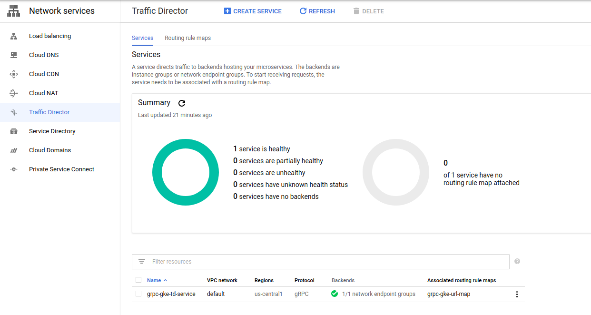
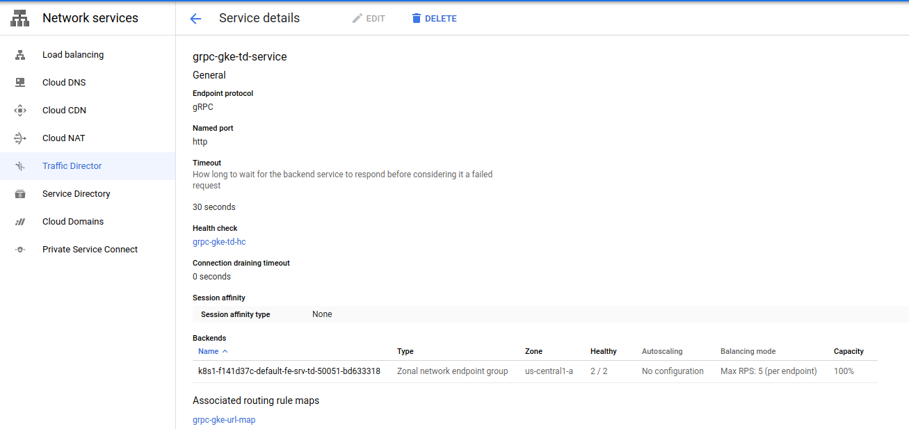
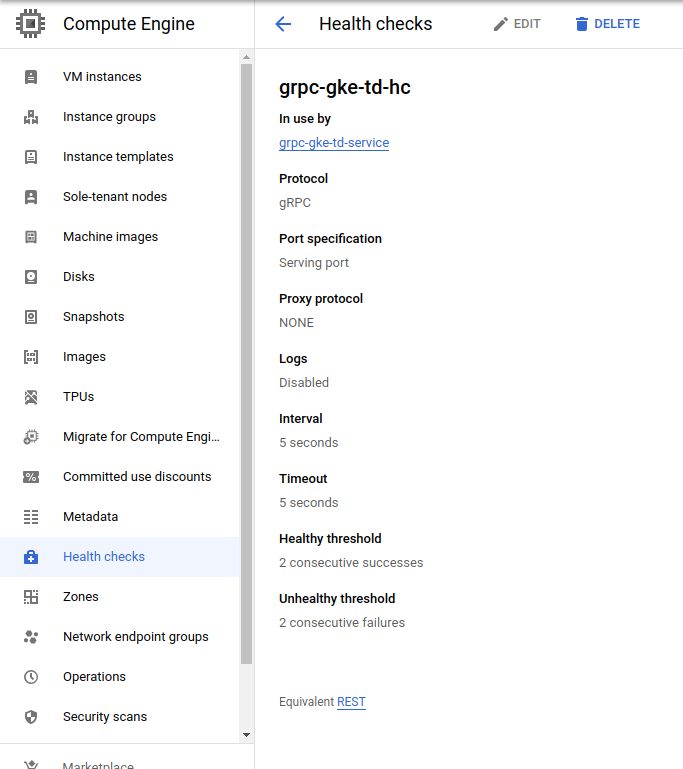

# GKE gRPC with TrafficDirector

Sample showing gRPC using Traffic Director Proxyless Loadbalancing

- [Traffic Director setup with Google Kubernetes Engine and proxyless gRPC services](https://cloud.google.com/traffic-director/docs/set-up-proxyless-gke)


This type of loadbalancing does not utilize an intermediate LB but rather each gRPC Client acquires a list of IP:port pairs for each GKE Pod where the service runs.
From there, each client is in charge of connecting _directly_ to the server's pod without a proxy.

In this mode

`client (on VM)` --> [acquire list of service NEG pods via xds] --> `gke pod with gRPC Service`


A couple of important notes:

* gRPC Server *must* have [gRPC HealthCheck](https://github.com/grpc/grpc/blob/master/doc/health-checking.md) enabled on the serving port
* gRPC Server *must not* use TLS (as of 1/25/21, TrafficDirector does not work with TLS) 


### Setup

The following steps are pretty much the same as the GCP Docs

```bash
gcloud container  clusters create cluster-grpc \
 --zone us-central1-a  --num-nodes 3 --enable-ip-alias \
 --tags=allow-health-checks --cluster-version "1.19"

NEG_NAME=$(gcloud compute network-endpoint-groups list | grep fe-srv-td | awk '{print $1}')
echo $NEG_NAME

gcloud compute health-checks create grpc grpc-gke-td-hc  --use-serving-port

gcloud compute firewall-rules create grpc-gke-allow-health-checks \
  --network default --action allow --direction INGRESS \
  --source-ranges 35.191.0.0/16,130.211.0.0/22 \
  --target-tags allow-health-checks \
  --rules tcp:50051

gcloud compute backend-services create grpc-gke-td-service \
   --global \
   --load-balancing-scheme=INTERNAL_SELF_MANAGED \
   --protocol=GRPC \
   --health-checks grpc-gke-td-hc

gcloud compute backend-services add-backend grpc-gke-td-service \
   --global \
   --network-endpoint-group $NEG_NAME \
   --network-endpoint-group-zone us-central1-a \
   --balancing-mode RATE \
   --max-rate-per-endpoint 5

gcloud compute url-maps create grpc-gke-url-map \
--default-service grpc-gke-td-service

gcloud compute url-maps add-path-matcher grpc-gke-url-map \
--default-service grpc-gke-td-service \
--path-matcher-name grpc-gke-path-matcher \
--new-hosts fe-srv-td:50051

gcloud compute target-grpc-proxies create grpc-gke-proxy \
--url-map grpc-gke-url-map \
--validate-for-proxyless

gcloud compute forwarding-rules create grpc-gke-forwarding-rule \
--global \
--load-balancing-scheme=INTERNAL_SELF_MANAGED \
--address=0.0.0.0 \
--target-grpc-proxy=grpc-gke-proxy \
--ports 50051 \
--network default
```

Now configure the service account 

```bash
export PROJECT_ID=`gcloud config get-value core/project`
export PROJECT_NUMBER=`gcloud projects describe $PROJECT_ID --format="value(projectNumber)"`
export SERVICE_ACCOUNT_EMAIL=xds-svc-client@$PROJECT_ID.iam.gserviceaccount.com

gcloud iam service-accounts create xds-svc-client --display-name "XDS Client Service Account"


gcloud projects add-iam-policy-binding ${PROJECT} \
   --member serviceAccount:${SERVICE_ACCOUNT_EMAIL} \
   --role roles/compute.networkViewer

gcloud projects add-iam-policy-binding ${PROJECT} \
   --member serviceAccount:${SERVICE_ACCOUNT_EMAIL} \
   --role roles/trafficdirector.client
```

```bash
cd gke_td_xds/

kubectl apply -f  fe-deployment.yaml -f fe-srv-td.yaml
```
Wait a couple of mins and you should see is traffic directory detecting the backend services you deployed







Now create a VM 

```bash
gcloud  compute  instances create xds-client-vm   --service-account=$SERVICE_ACCOUNT_EMAIL   --scopes=https://www.googleapis.com/auth/cloud-platform   --zone us-central1-a --image-family debian-10  --image-project=debian-cloud

gcloud compute ssh xds-client-vm  --zone  us-central1-a

apt-get update && apt-get install wget zip -y

# Install golang
wget https://golang.org/dl/go1.15.7.linux-amd64.tar.gz
sudo tar -C /usr/local -xzf go1.15.7.linux-amd64.tar.gz
export PATH=$PATH:/usr/local/go/bin
```

Acquire the xds grpc Client:

```bash
git clone https://github.com/salrashid123/gcegrpc.git
cd gcegrpc/gke_td_xds/client

export PROJECT_NUMBER=`curl -s "http://metadata.google.internal/computeMetadata/v1/project/numeric-project-id" -H "Metadata-Flavor: Google"`
echo $PROJECT_NUMBER

envsubst < "xds_bootstrap.json" > "xds_bootstrap.json"

export GRPC_XDS_BOOTSTRAP=`pwd`/xds_bootstrap.json
go run src/grpc_client.go --host xds:///fe-srv-td:50051
```


What you should see is the list of backend

```bash
$ go run src/grpc_client.go --host xds:///fe-srv-td:50051
   2021/01/25 05:51:52 RPC Response: 0 message:"Hello unary RPC msg   from hostname fe-deployment-fffb47bc7-ks9pz" 
   2021/01/25 05:51:53 RPC Response: 1 message:"Hello unary RPC msg   from hostname fe-deployment-fffb47bc7-ks9pz" 
   2021/01/25 05:51:54 RPC Response: 2 message:"Hello unary RPC msg   from hostname fe-deployment-fffb47bc7-qpnc8" 
   2021/01/25 05:51:55 RPC Response: 3 message:"Hello unary RPC msg   from hostname fe-deployment-fffb47bc7-ks9pz" 
   2021/01/25 05:51:56 RPC Response: 4 message:"Hello unary RPC msg   from hostname fe-deployment-fffb47bc7-qpnc8" 
   2021/01/25 05:51:57 RPC Response: 5 message:"Hello unary RPC msg   from hostname fe-deployment-fffb47bc7-ks9pz" 
   2021/01/25 05:51:58 RPC Response: 6 message:"Hello unary RPC msg   from hostname fe-deployment-fffb47bc7-qpnc8" 
   2021/01/25 05:51:59 RPC Response: 7 message:"Hello unary RPC msg   from hostname fe-deployment-fffb47bc7-ks9pz" 
   2021/01/25 05:52:00 RPC Response: 8 message:"Hello unary RPC msg   from hostname fe-deployment-fffb47bc7-qpnc8" 
   2021/01/25 05:52:01 RPC Response: 9 message:"Hello unary RPC msg   from hostname fe-deployment-fffb47bc7-ks9pz" 
   2021/01/25 05:52:02 RPC Response: 10 message:"Hello unary RPC msg   from hostname fe-deployment-fffb47bc7-qpnc8" 
   2021/01/25 05:52:03 RPC Response: 11 message:"Hello unary RPC msg   from hostname fe-deployment-fffb47bc7-ks9pz" 
   2021/01/25 05:52:04 RPC Response: 12 message:"Hello unary RPC msg   from hostname fe-deployment-fffb47bc7-qpnc8" 
   2021/01/25 05:52:05 RPC Response: 13 message:"Hello unary RPC msg   from hostname fe-deployment-fffb47bc7-ks9pz" 
   2021/01/25 05:52:06 RPC Response: 14 message:"Hello unary RPC msg   from hostname fe-deployment-fffb47bc7-qpnc8"
```

#### References

- [gRPC xDS Loadbalancing](https://github.com/salrashid123/grpc_xds)
- [gRPC HealthCheck Proxy](https://github.com/salrashid123/grpc_health_proxy)
- [Proxyless gRPC with Google Traffic Director](https://github.com/salrashid123/grpc_xds_traffic_director)
- [Kubernetes xDS service for gRPC loadbalancing](https://github.com/salrashid123/k8s_grpc_xds)

---

To enable verbose logging, first set


```log
export GRPC_GO_LOG_VERBOSITY_LEVEL=99
export GRPC_GO_LOG_SEVERITY_LEVEL=info

$ go run src/grpc_client.go --host xds:///fe-srv-td:50051
INFO: 2021/01/25 12:25:34 [core] parsed scheme: "xds"
INFO: 2021/01/25 12:25:34 [xds] [xds-bootstrap] Got bootstrap file location from GRPC_XDS_BOOTSTRAP environment variable: /home/srashid/gke_td_xds/client/xds_bootstrap.json
INFO: 2021/01/25 12:25:34 [xds] [xds-bootstrap] Bootstrap content: {
  "xds_servers": [
    {
      "server_uri": "trafficdirector.googleapis.com:443",
      "channel_creds": [
        {
          "type": "google_default"
        }
      ]      
    }
  ],
  "node": {
    "id": "b7f9c818-fb46-43ca-8662-d3bdbcf7ec18~10.0.0.1",
    "metadata": {
      "TRAFFICDIRECTOR_GCP_PROJECT_NUMBER": "1071284184436",
      "TRAFFICDIRECTOR_NETWORK_NAME": "default"
    },
    "locality": {
      "zone": "us-central1-a"
    }
  }
}


INFO: 2021/01/25 12:25:34 [xds] [xds-bootstrap] Bootstrap config for creating xds-client: &{BalancerName:trafficdirector.googleapis.com:443 Creds:0xc000266a70 TransportAPI:0 NodeProto:id:"b7f9c818-fb46-43ca-8662-d3bdbcf7ec18~10.0.0.1" metadata:<fields:<key:"TRAFFICDIRECTOR_GCP_PROJECT_NUMBER" value:<string_value:"1071284184436" > > fields:<key:"TRAFFICDIRECTOR_NETWORK_NAME" value:<string_value:"default" > > > locality:<zone:"us-central1-a" > build_version:"gRPC Go 1.33.2" user_agent_name:"gRPC Go" user_agent_version:"1.33.2" client_features:"envoy.lb.does_not_support_overprovisioning"  CertProviderConfigs:map[]}
INFO: 2021/01/25 12:25:34 [xds] [xds-resolver 0xc0004f3700] Creating resolver for target: {Scheme:xds Authority: Endpoint:fe-srv-td:50051}
INFO: 2021/01/25 12:25:34 [core] parsed scheme: ""
INFO: 2021/01/25 12:25:34 [core] scheme "" not registered, fallback to default scheme
INFO: 2021/01/25 12:25:34 [core] ccResolverWrapper: sending update to cc: {[{trafficdirector.googleapis.com:443  <nil> 0 <nil>}] <nil> <nil>}
INFO: 2021/01/25 12:25:34 [core] ClientConn switching balancer to "pick_first"
INFO: 2021/01/25 12:25:34 [core] Channel switches to new LB policy "pick_first"
INFO: 2021/01/25 12:25:34 [core] Subchannel Connectivity change to CONNECTING
INFO: 2021/01/25 12:25:34 [xds] [xds-client 0xc0000ba000] Created ClientConn to xDS server: trafficdirector.googleapis.com:443
INFO: 2021/01/25 12:25:34 [xds] [xds-client 0xc0000ba000] Created
INFO: 2021/01/25 12:25:34 [xds] [xds-client 0xc0000ba000] new watch for type ListenerResource, resource name fe-srv-td:50051
INFO: 2021/01/25 12:25:34 [xds] [xds-client 0xc0000ba000] first watch for type ListenerResource, resource name fe-srv-td:50051, will send a new xDS request
INFO: 2021/01/25 12:25:34 [xds] [xds-resolver 0xc0004f3700] Watch started on resource name fe-srv-td:50051 with xds-client 0xc0000ba000
INFO: 2021/01/25 12:25:34 [core] pickfirstBalancer: UpdateSubConnState: 0xc00020f670, {CONNECTING <nil>}
INFO: 2021/01/25 12:25:34 [core] Channel Connectivity change to CONNECTING
INFO: 2021/01/25 12:25:34 [core] Subchannel picks a new address "trafficdirector.googleapis.com:443" to connect
INFO: 2021/01/25 12:25:34 [core] Subchannel Connectivity change to READY
INFO: 2021/01/25 12:25:34 [core] pickfirstBalancer: UpdateSubConnState: 0xc00020f670, {READY <nil>}
INFO: 2021/01/25 12:25:34 [core] Channel Connectivity change to READY
INFO: 2021/01/25 12:25:34 [xds] [xds-client 0xc0000ba000] ADS stream created
INFO: 2021/01/25 12:25:34 [xds] [xds-client 0xc0000ba000] ADS request sent: node:<id:"b7f9c818-fb46-43ca-8662-d3bdbcf7ec18~10.0.0.1" metadata:<fields:<key:"TRAFFICDIRECTOR_GCP_PROJECT_NUMBER" value:<string_value:"1071284184436" > > fields:<key:"TRAFFICDIRECTOR_NETWORK_NAME" value:<string_value:"default" > > > locality:<zone:"us-central1-a" > build_version:"gRPC Go 1.33.2" user_agent_name:"gRPC Go" user_agent_version:"1.33.2" client_features:"envoy.lb.does_not_support_overprovisioning" > resource_names:"fe-srv-td:50051" type_url:"type.googleapis.com/envoy.api.v2.Listener" 
INFO: 2021/01/25 12:25:34 [xds] [xds-client 0xc0000ba000] ADS response received, type: type.googleapis.com/envoy.api.v2.Listener
INFO: 2021/01/25 12:25:34 [xds] [xds-client 0xc0000ba000] ADS response received: version_info:"1611552246570604226" resources:<type_url:"type.googleapis.com/envoy.api.v2.Listener" value:"\n\017fe-srv-td:50051\232\001\270\001\n\265\001\n`type.googleapis.com/envoy.config.filter.network.http_connection_manager.v2.HttpConnectionManager\022Q\022\017trafficdirector\032>\n\002\032\000\0228URL_MAP/1071284184436_grpc-gke-url-map_0_fe-srv-td:50051" > type_url:"type.googleapis.com/envoy.api.v2.Listener" nonce:"1" 
INFO: 2021/01/25 12:25:34 [xds] [xds-client 0xc0000ba000] Resource with name: fe-srv-td:50051, type: *envoy_config_listener_v3.Listener, contains: name:"fe-srv-td:50051" api_listener:<api_listener:<type_url:"type.googleapis.com/envoy.config.filter.network.http_connection_manager.v2.HttpConnectionManager" value:"\022\017trafficdirector\032>\n\002\032\000\0228URL_MAP/1071284184436_grpc-gke-url-map_0_fe-srv-td:50051" > > 
INFO: 2021/01/25 12:25:34 [xds] [xds-client 0xc0000ba000] Resource with type *envoy_extensions_filters_network_http_connection_manager_v3.HttpConnectionManager, contains stat_prefix:"trafficdirector" rds:<config_source:<ads:<> > route_config_name:"URL_MAP/1071284184436_grpc-gke-url-map_0_fe-srv-td:50051" > 
INFO: 2021/01/25 12:25:34 [xds] [xds-client 0xc0000ba000] LDS resource with name fe-srv-td:50051, value {RouteConfigName:URL_MAP/1071284184436_grpc-gke-url-map_0_fe-srv-td:50051} added to cache
INFO: 2021/01/25 12:25:34 [xds] [xds-client 0xc0000ba000] Sending ACK for response type: ListenerResource, version: 1611552246570604226, nonce: 1
INFO: 2021/01/25 12:25:34 [xds] [xds-client 0xc0000ba000] ADS request sent: version_info:"1611552246570604226" node:<id:"b7f9c818-fb46-43ca-8662-d3bdbcf7ec18~10.0.0.1" metadata:<fields:<key:"TRAFFICDIRECTOR_GCP_PROJECT_NUMBER" value:<string_value:"1071284184436" > > fields:<key:"TRAFFICDIRECTOR_NETWORK_NAME" value:<string_value:"default" > > > locality:<zone:"us-central1-a" > build_version:"gRPC Go 1.33.2" user_agent_name:"gRPC Go" user_agent_version:"1.33.2" client_features:"envoy.lb.does_not_support_overprovisioning" > resource_names:"fe-srv-td:50051" type_url:"type.googleapis.com/envoy.api.v2.Listener" response_nonce:"1" 
INFO: 2021/01/25 12:25:34 [xds] [xds-client 0xc0000ba000] xds: client received LDS update: {RouteConfigName:URL_MAP/1071284184436_grpc-gke-url-map_0_fe-srv-td:50051}, err: <nil>
INFO: 2021/01/25 12:25:34 [xds] [xds-client 0xc0000ba000] new watch for type RouteConfigResource, resource name URL_MAP/1071284184436_grpc-gke-url-map_0_fe-srv-td:50051
INFO: 2021/01/25 12:25:34 [xds] [xds-client 0xc0000ba000] first watch for type RouteConfigResource, resource name URL_MAP/1071284184436_grpc-gke-url-map_0_fe-srv-td:50051, will send a new xDS request
INFO: 2021/01/25 12:25:34 [xds] [xds-client 0xc0000ba000] ADS request sent: node:<id:"b7f9c818-fb46-43ca-8662-d3bdbcf7ec18~10.0.0.1" metadata:<fields:<key:"TRAFFICDIRECTOR_GCP_PROJECT_NUMBER" value:<string_value:"1071284184436" > > fields:<key:"TRAFFICDIRECTOR_NETWORK_NAME" value:<string_value:"default" > > > locality:<zone:"us-central1-a" > build_version:"gRPC Go 1.33.2" user_agent_name:"gRPC Go" user_agent_version:"1.33.2" client_features:"envoy.lb.does_not_support_overprovisioning" > resource_names:"URL_MAP/1071284184436_grpc-gke-url-map_0_fe-srv-td:50051" type_url:"type.googleapis.com/envoy.api.v2.RouteConfiguration" 
INFO: 2021/01/25 12:25:34 [xds] [xds-client 0xc0000ba000] ADS response received, type: type.googleapis.com/envoy.api.v2.RouteConfiguration
INFO: 2021/01/25 12:25:34 [xds] [xds-client 0xc0000ba000] ADS response received: version_info:"1611552246570604226" resources:<type_url:"type.googleapis.com/envoy.api.v2.RouteConfiguration" value:"\n8URL_MAP/1071284184436_grpc-gke-url-map_0_fe-srv-td:50051\022w\022\017fe-srv-td:50051\032d\n\002\n\000\022^\n?cloud-internal-istio:cloud_mp_1071284184436_6715107724690188851B\002\010\036J\027\n\rgateway-error\022\002\010\001\032\002\010\036" > type_url:"type.googleapis.com/envoy.api.v2.RouteConfiguration" nonce:"1" 
INFO: 2021/01/25 12:25:34 [xds] [xds-client 0xc0000ba000] Resource with name: URL_MAP/1071284184436_grpc-gke-url-map_0_fe-srv-td:50051, type: *envoy_config_route_v3.RouteConfiguration, contains: name:"URL_MAP/1071284184436_grpc-gke-url-map_0_fe-srv-td:50051" virtual_hosts:<domains:"fe-srv-td:50051" routes:<match:<prefix:"" > route:<cluster:"cloud-internal-istio:cloud_mp_1071284184436_6715107724690188851" timeout:<seconds:30 > retry_policy:<retry_on:"gateway-error" num_retries:<value:1 > per_try_timeout:<seconds:30 > > > > > . Picking routes for current watching hostname fe-srv-td:50051
INFO: 2021/01/25 12:25:34 [xds] [xds-client 0xc0000ba000] RDS resource with name URL_MAP/1071284184436_grpc-gke-url-map_0_fe-srv-td:50051, value {Routes:[0xc00046aac0]} added to cache
INFO: 2021/01/25 12:25:34 [xds] [xds-client 0xc0000ba000] Sending ACK for response type: RouteConfigResource, version: 1611552246570604226, nonce: 1
INFO: 2021/01/25 12:25:34 [xds] [xds-client 0xc0000ba000] ADS request sent: version_info:"1611552246570604226" node:<id:"b7f9c818-fb46-43ca-8662-d3bdbcf7ec18~10.0.0.1" metadata:<fields:<key:"TRAFFICDIRECTOR_GCP_PROJECT_NUMBER" value:<string_value:"1071284184436" > > fields:<key:"TRAFFICDIRECTOR_NETWORK_NAME" value:<string_value:"default" > > > locality:<zone:"us-central1-a" > build_version:"gRPC Go 1.33.2" user_agent_name:"gRPC Go" user_agent_version:"1.33.2" client_features:"envoy.lb.does_not_support_overprovisioning" > resource_names:"URL_MAP/1071284184436_grpc-gke-url-map_0_fe-srv-td:50051" type_url:"type.googleapis.com/envoy.api.v2.RouteConfiguration" response_nonce:"1" 
INFO: 2021/01/25 12:25:34 [xds] [xds-client 0xc0000ba000] xds: client received RDS update: {Routes:[0xc00046aac0]}, err: <nil>
INFO: 2021/01/25 12:25:34 [xds] [xds-resolver 0xc0004f3700] Received update on resource fe-srv-td:50051 from xds-client 0xc0000ba000, generated service config: {"loadBalancingConfig":[{"xds_routing_experimental":{"action":{"cloud-internal-istio:cloud_mp_1071284184436_6715107724690188851_964740686":{"childPolicy":[{"weighted_target_experimental":{"targets":{"cloud-internal-istio:cloud_mp_1071284184436_6715107724690188851":{"weight":1,"childPolicy":[{"cds_experimental":{"cluster":"cloud-internal-istio:cloud_mp_1071284184436_6715107724690188851"}}]}}}}]}},"route":[{"prefix":"","action":"cloud-internal-istio:cloud_mp_1071284184436_6715107724690188851_964740686"}]}}]}
INFO: 2021/01/25 12:25:34 [core] ccResolverWrapper: sending update to cc: {[] 0xc00029e0c0 0xc0003606a8}
INFO: 2021/01/25 12:25:34 [core] ClientConn switching balancer to "xds_routing_experimental"
INFO: 2021/01/25 12:25:34 [core] Channel switches to new LB policy "xds_routing_experimental"
INFO: 2021/01/25 12:25:34 [xds] [xds-routing-lb 0xc00046ad80] Created
INFO: 2021/01/25 12:25:34 [xds] [xds-routing-lb 0xc00046ad80] update with config &{LoadBalancingConfig:<nil> routes:[{path: prefix: regex: headers:[] fraction:<nil> action:cloud-internal-istio:cloud_mp_1071284184436_6715107724690188851_964740686}] actions:map[cloud-internal-istio:cloud_mp_1071284184436_6715107724690188851_964740686:{ChildPolicy:0xc000295cc0}]}, resolver state {Addresses:[] ServiceConfig:0xc00029e0c0 Attributes:0xc0003606a8}
INFO: 2021/01/25 12:25:34 [xds] [weighted-target-lb 0xc00029e2c0] Created
INFO: 2021/01/25 12:25:34 [xds] [xds-routing-lb 0xc00046ad80] Created child policy 0xc00029e2c0 of type weighted_target_experimental
INFO: 2021/01/25 12:25:34 [xds] [cds-lb 0xc0002f9740] Created
INFO: 2021/01/25 12:25:34 [xds] [weighted-target-lb 0xc00029e2c0] Created child policy 0xc0002f9740 of type cds_experimental
INFO: 2021/01/25 12:25:34 [xds] [cds-lb 0xc0002f9740] Received update from resolver, balancer config: &{LoadBalancingConfig:<nil> ClusterName:cloud-internal-istio:cloud_mp_1071284184436_6715107724690188851}
INFO: 2021/01/25 12:25:34 [xds] [xds-routing-lb 0xc00046ad80] Child pickers with routes: [pathPrefix:->cloud-internal-istio:cloud_mp_1071284184436_6715107724690188851_964740686], actions: map[cloud-internal-istio:cloud_mp_1071284184436_6715107724690188851_964740686:picker:0xc0004e5520,state:CONNECTING,stateToAggregate:CONNECTING]
INFO: 2021/01/25 12:25:34 [core] Channel Connectivity change to CONNECTING
INFO: 2021/01/25 12:25:34 [xds] [xds-client 0xc0000ba000] new watch for type ClusterResource, resource name cloud-internal-istio:cloud_mp_1071284184436_6715107724690188851
INFO: 2021/01/25 12:25:34 [xds] [xds-client 0xc0000ba000] first watch for type ClusterResource, resource name cloud-internal-istio:cloud_mp_1071284184436_6715107724690188851, will send a new xDS request
INFO: 2021/01/25 12:25:34 [xds] [cds-lb 0xc0002f9740] Watch started on resource name cloud-internal-istio:cloud_mp_1071284184436_6715107724690188851 with xds-client 0xc0000ba000
INFO: 2021/01/25 12:25:34 [xds] [xds-client 0xc0000ba000] ADS request sent: node:<id:"b7f9c818-fb46-43ca-8662-d3bdbcf7ec18~10.0.0.1" metadata:<fields:<key:"TRAFFICDIRECTOR_GCP_PROJECT_NUMBER" value:<string_value:"1071284184436" > > fields:<key:"TRAFFICDIRECTOR_NETWORK_NAME" value:<string_value:"default" > > > locality:<zone:"us-central1-a" > build_version:"gRPC Go 1.33.2" user_agent_name:"gRPC Go" user_agent_version:"1.33.2" client_features:"envoy.lb.does_not_support_overprovisioning" > resource_names:"cloud-internal-istio:cloud_mp_1071284184436_6715107724690188851" type_url:"type.googleapis.com/envoy.api.v2.Cluster" 
INFO: 2021/01/25 12:25:34 [xds] [xds-client 0xc0000ba000] ADS response received, type: type.googleapis.com/envoy.api.v2.Cluster
INFO: 2021/01/25 12:25:34 [xds] [xds-client 0xc0000ba000] ADS response received: version_info:"1611552246570604226" resources:<type_url:"type.googleapis.com/envoy.api.v2.Cluster" value:"\n?cloud-internal-istio:cloud_mp_1071284184436_6715107724690188851\020\003\032\004\n\002\032\000\"\002\010\036R\"\n \022\006\010\377\377\377\377\007\032\006\010\377\377\377\377\007\"\006\010\377\377\377\377\007*\006\010\377\377\377\377\007r\004\022\002\010d\312\001O\nM\n\032com.google.trafficdirector\022/\n-\n\024backend_service_name\022\025\032\023grpc-gke-td-service\332\001\r\n\t\t\000\000\000\000\000\000\360?\032\000\322\002\002*\000" > type_url:"type.googleapis.com/envoy.api.v2.Cluster" nonce:"1" 
INFO: 2021/01/25 12:25:34 [xds] [xds-client 0xc0000ba000] Resource with name: cloud-internal-istio:cloud_mp_1071284184436_6715107724690188851, type: *envoy_config_cluster_v3.Cluster, contains: name:"cloud-internal-istio:cloud_mp_1071284184436_6715107724690188851" type:EDS eds_cluster_config:<eds_config:<ads:<> > > connect_timeout:<seconds:30 > circuit_breakers:<thresholds:<max_connections:<value:2147483647 > max_pending_requests:<value:2147483647 > max_requests:<value:2147483647 > max_retries:<value:2147483647 > > > http2_protocol_options:<max_concurrent_streams:<value:100 > > common_lb_config:<healthy_panic_threshold:<value:1 > locality_weighted_lb_config:<> > metadata:<filter_metadata:<key:"com.google.trafficdirector" value:<fields:<key:"backend_service_name" value:<string_value:"grpc-gke-td-service" > > > > > lrs_server:<self:<> > 
INFO: 2021/01/25 12:25:34 [xds] [xds-client 0xc0000ba000] Resource with name cloud-internal-istio:cloud_mp_1071284184436_6715107724690188851, value {ServiceName:cloud-internal-istio:cloud_mp_1071284184436_6715107724690188851 EnableLRS:true} added to cache
INFO: 2021/01/25 12:25:34 [xds] [xds-client 0xc0000ba000] CDS resource with name cloud-internal-istio:cloud_mp_1071284184436_6715107724690188851, value {ServiceName:cloud-internal-istio:cloud_mp_1071284184436_6715107724690188851 EnableLRS:true} added to cache
INFO: 2021/01/25 12:25:34 [xds] [xds-client 0xc0000ba000] Sending ACK for response type: ClusterResource, version: 1611552246570604226, nonce: 1
INFO: 2021/01/25 12:25:34 [xds] [xds-client 0xc0000ba000] ADS request sent: version_info:"1611552246570604226" node:<id:"b7f9c818-fb46-43ca-8662-d3bdbcf7ec18~10.0.0.1" metadata:<fields:<key:"TRAFFICDIRECTOR_GCP_PROJECT_NUMBER" value:<string_value:"1071284184436" > > fields:<key:"TRAFFICDIRECTOR_NETWORK_NAME" value:<string_value:"default" > > > locality:<zone:"us-central1-a" > build_version:"gRPC Go 1.33.2" user_agent_name:"gRPC Go" user_agent_version:"1.33.2" client_features:"envoy.lb.does_not_support_overprovisioning" > resource_names:"cloud-internal-istio:cloud_mp_1071284184436_6715107724690188851" type_url:"type.googleapis.com/envoy.api.v2.Cluster" response_nonce:"1" 
INFO: 2021/01/25 12:25:34 [xds] [cds-lb 0xc0002f9740] Watch update from xds-client 0xc0000ba000, content: {ServiceName:cloud-internal-istio:cloud_mp_1071284184436_6715107724690188851 EnableLRS:true}
INFO: 2021/01/25 12:25:34 [xds] [eds-lb 0xc00060ae40] Created
INFO: 2021/01/25 12:25:34 [xds] [cds-lb 0xc0002f9740] Created child policy 0xc00060ae40 of type eds_experimental
INFO: 2021/01/25 12:25:34 [xds] [eds-lb 0xc00060ae40] Receive update from resolver, balancer config: &{LoadBalancingConfig:<nil> BalancerName: ChildPolicy:<nil> FallBackPolicy:<nil> EDSServiceName:cloud-internal-istio:cloud_mp_1071284184436_6715107724690188851 LrsLoadReportingServerName:0xc0005562d0}
INFO: 2021/01/25 12:25:34 [xds] [xds-client 0xc0000ba000] new watch for type EndpointsResource, resource name cloud-internal-istio:cloud_mp_1071284184436_6715107724690188851
INFO: 2021/01/25 12:25:34 [xds] [xds-client 0xc0000ba000] first watch for type EndpointsResource, resource name cloud-internal-istio:cloud_mp_1071284184436_6715107724690188851, will send a new xDS request
INFO: 2021/01/25 12:25:34 [xds] [eds-lb 0xc00060ae40] Watch started on resource name cloud-internal-istio:cloud_mp_1071284184436_6715107724690188851 with xds-client 0xc0000ba000
INFO: 2021/01/25 12:25:34 [xds] [xds-client 0xc0000ba000] Starting load report to server: 
INFO: 2021/01/25 12:25:34 [xds] lrs: created LRS stream
INFO: 2021/01/25 12:25:34 [xds] [xds-client 0xc0000ba000] lrs: sending init LoadStatsRequest: node:<id:"b7f9c818-fb46-43ca-8662-d3bdbcf7ec18~10.0.0.1" metadata:<fields:<key:"PROXYLESS_CLIENT_HOSTNAME" value:<string_value:"fe-srv-td:50051" > > fields:<key:"TRAFFICDIRECTOR_GCP_PROJECT_NUMBER" value:<string_value:"1071284184436" > > fields:<key:"TRAFFICDIRECTOR_NETWORK_NAME" value:<string_value:"default" > > > locality:<zone:"us-central1-a" > build_version:"gRPC Go 1.33.2" user_agent_name:"gRPC Go" user_agent_version:"1.33.2" client_features:"envoy.lb.does_not_support_overprovisioning" > 
INFO: 2021/01/25 12:25:34 [xds] [xds-client 0xc0000ba000] ADS request sent: node:<id:"b7f9c818-fb46-43ca-8662-d3bdbcf7ec18~10.0.0.1" metadata:<fields:<key:"TRAFFICDIRECTOR_GCP_PROJECT_NUMBER" value:<string_value:"1071284184436" > > fields:<key:"TRAFFICDIRECTOR_NETWORK_NAME" value:<string_value:"default" > > > locality:<zone:"us-central1-a" > build_version:"gRPC Go 1.33.2" user_agent_name:"gRPC Go" user_agent_version:"1.33.2" client_features:"envoy.lb.does_not_support_overprovisioning" > resource_names:"cloud-internal-istio:cloud_mp_1071284184436_6715107724690188851" type_url:"type.googleapis.com/envoy.api.v2.ClusterLoadAssignment" 
INFO: 2021/01/25 12:25:34 [xds] [xds-client 0xc0000ba000] ADS response received, type: type.googleapis.com/envoy.api.v2.ClusterLoadAssignment
INFO: 2021/01/25 12:25:34 [xds] [xds-client 0xc0000ba000] ADS response received: version_info:"1" resources:<type_url:"type.googleapis.com/envoy.api.v2.ClusterLoadAssignment" value:"\n?cloud-internal-istio:cloud_mp_1071284184436_6715107724690188851\022d\n*\032(jf:us-central1-a_3735266836428877066_neg\022\030\n\024\n\022\n\020\022\n10.12.1.26\030\203\207\003\020\001\022\030\n\024\n\022\n\020\022\n10.12.0.27\030\203\207\003\020\001\032\002\010d" > type_url:"type.googleapis.com/envoy.api.v2.ClusterLoadAssignment" nonce:"1" 
INFO: 2021/01/25 12:25:34 [xds] [xds-client 0xc0000ba000] Resource with name: cloud-internal-istio:cloud_mp_1071284184436_6715107724690188851, type: *envoy_config_endpoint_v3.ClusterLoadAssignment, contains: cluster_name:"cloud-internal-istio:cloud_mp_1071284184436_6715107724690188851" endpoints:<locality:<sub_zone:"jf:us-central1-a_3735266836428877066_neg" > lb_endpoints:<endpoint:<address:<socket_address:<address:"10.12.1.26" port_value:50051 > > > health_status:HEALTHY > lb_endpoints:<endpoint:<address:<socket_address:<address:"10.12.0.27" port_value:50051 > > > health_status:HEALTHY > load_balancing_weight:<value:100 > > 
INFO: 2021/01/25 12:25:34 [xds] [xds-client 0xc0000ba000] EDS resource with name cloud-internal-istio:cloud_mp_1071284184436_6715107724690188851, value {Drops:[] Localities:[{Endpoints:[{Address:10.12.1.26:50051 HealthStatus:1 Weight:0} {Address:10.12.0.27:50051 HealthStatus:1 Weight:0}] ID:::jf:us-central1-a_3735266836428877066_neg Priority:0 Weight:100}]} added to cache
INFO: 2021/01/25 12:25:34 [xds] [xds-client 0xc0000ba000] Sending ACK for response type: EndpointsResource, version: 1, nonce: 1
INFO: 2021/01/25 12:25:34 [xds] [xds-client 0xc0000ba000] ADS request sent: version_info:"1" node:<id:"b7f9c818-fb46-43ca-8662-d3bdbcf7ec18~10.0.0.1" metadata:<fields:<key:"TRAFFICDIRECTOR_GCP_PROJECT_NUMBER" value:<string_value:"1071284184436" > > fields:<key:"TRAFFICDIRECTOR_NETWORK_NAME" value:<string_value:"default" > > > locality:<zone:"us-central1-a" > build_version:"gRPC Go 1.33.2" user_agent_name:"gRPC Go" user_agent_version:"1.33.2" client_features:"envoy.lb.does_not_support_overprovisioning" > resource_names:"cloud-internal-istio:cloud_mp_1071284184436_6715107724690188851" type_url:"type.googleapis.com/envoy.api.v2.ClusterLoadAssignment" response_nonce:"1" 
INFO: 2021/01/25 12:25:34 [xds] [eds-lb 0xc00060ae40] Watch update from xds-client 0xc0000ba000, content: {Drops:[] Localities:[{Endpoints:[{Address:10.12.1.26:50051 HealthStatus:1 Weight:0} {Address:10.12.0.27:50051 HealthStatus:1 Weight:0}] ID:::jf:us-central1-a_3735266836428877066_neg Priority:0 Weight:100}]}
INFO: 2021/01/25 12:25:34 [xds] [eds-lb 0xc00060ae40] New priority 0 added
INFO: 2021/01/25 12:25:34 [xds] [eds-lb 0xc00060ae40] New locality ::jf:us-central1-a_3735266836428877066_neg added
INFO: 2021/01/25 12:25:34 [xds] [eds-lb 0xc00060ae40] Switching priority from unset to 0
INFO: 2021/01/25 12:25:34 [xds] [eds-lb 0xc00060ae40] Created child policy 0xc00066ff80 of type round_robin
INFO: 2021/01/25 12:25:34 [balancer] base.baseBalancer: got new ClientConn state:  {{[{10.12.1.26:50051  <nil> 0 <nil>} {10.12.0.27:50051  <nil> 0 <nil>}] <nil> <nil>} <nil>}
INFO: 2021/01/25 12:25:34 [core] Subchannel Connectivity change to CONNECTING
INFO: 2021/01/25 12:25:34 [core] Subchannel Connectivity change to CONNECTING
INFO: 2021/01/25 12:25:34 [core] Subchannel picks a new address "10.12.0.27:50051" to connect
INFO: 2021/01/25 12:25:34 [balancer] base.baseBalancer: handle SubConn state change: 0xc00056f1b0, CONNECTING
INFO: 2021/01/25 12:25:34 [xds] [eds-lb 0xc00060ae40] Balancer state update from locality ::jf:us-central1-a_3735266836428877066_neg, new state: {ConnectivityState:CONNECTING Picker:0xc00056f0d0}
INFO: 2021/01/25 12:25:34 [xds] [eds-lb 0xc00060ae40] Child pickers with config: map[::jf:us-central1-a_3735266836428877066_neg:weight:100,picker:0xc00070ed80,state:CONNECTING,stateToAggregate:CONNECTING]
INFO: 2021/01/25 12:25:34 [xds] [weighted-target-lb 0xc00029e2c0] Balancer state update from locality cloud-internal-istio:cloud_mp_1071284184436_6715107724690188851, new state: {ConnectivityState:CONNECTING Picker:0xc0006e18c0}
INFO: 2021/01/25 12:25:34 [xds] [weighted-target-lb 0xc00029e2c0] Child pickers with config: map[cloud-internal-istio:cloud_mp_1071284184436_6715107724690188851:weight:1,picker:0xc0006e18c0,state:CONNECTING,stateToAggregate:CONNECTING]
INFO: 2021/01/25 12:25:34 [xds] [xds-routing-lb 0xc00046ad80] Balancer state update from locality cloud-internal-istio:cloud_mp_1071284184436_6715107724690188851_964740686, new state: {ConnectivityState:CONNECTING Picker:0xc00056f580}
INFO: 2021/01/25 12:25:34 [xds] [xds-routing-lb 0xc00046ad80] Child pickers with routes: [pathPrefix:->cloud-internal-istio:cloud_mp_1071284184436_6715107724690188851_964740686], actions: map[cloud-internal-istio:cloud_mp_1071284184436_6715107724690188851_964740686:picker:0xc00056f580,state:CONNECTING,stateToAggregate:CONNECTING]
INFO: 2021/01/25 12:25:34 [balancer] base.baseBalancer: handle SubConn state change: 0xc00056f230, CONNECTING
INFO: 2021/01/25 12:25:34 [xds] [eds-lb 0xc00060ae40] Balancer state update from locality ::jf:us-central1-a_3735266836428877066_neg, new state: {ConnectivityState:CONNECTING Picker:0xc00056f0d0}
INFO: 2021/01/25 12:25:34 [xds] [eds-lb 0xc00060ae40] Child pickers with config: map[::jf:us-central1-a_3735266836428877066_neg:weight:100,picker:0xc00070eed0,state:CONNECTING,stateToAggregate:CONNECTING]
INFO: 2021/01/25 12:25:34 [core] Subchannel picks a new address "10.12.1.26:50051" to connect
INFO: 2021/01/25 12:25:34 [core] Subchannel Connectivity change to READY
INFO: 2021/01/25 12:25:34 [balancer] base.baseBalancer: handle SubConn state change: 0xc00056f230, READY
INFO: 2021/01/25 12:25:34 [roundrobin] roundrobinPicker: newPicker called with info: {map[0xc00056f230:{{10.12.0.27:50051  <nil> 0 <nil>}}]}
INFO: 2021/01/25 12:25:34 [xds] [eds-lb 0xc00060ae40] Balancer state update from locality ::jf:us-central1-a_3735266836428877066_neg, new state: {ConnectivityState:READY Picker:0xc00070f380}
INFO: 2021/01/25 12:25:34 [xds] [eds-lb 0xc00060ae40] Child pickers with config: map[::jf:us-central1-a_3735266836428877066_neg:weight:100,picker:0xc00070f3b0,state:READY,stateToAggregate:READY]
INFO: 2021/01/25 12:25:34 [xds] [weighted-target-lb 0xc00029e2c0] Balancer state update from locality cloud-internal-istio:cloud_mp_1071284184436_6715107724690188851, new state: {ConnectivityState:READY Picker:0xc0006e1a80}
INFO: 2021/01/25 12:25:34 [xds] [weighted-target-lb 0xc00029e2c0] Child pickers with config: map[cloud-internal-istio:cloud_mp_1071284184436_6715107724690188851:weight:1,picker:0xc0006e1a80,state:READY,stateToAggregate:READY]
INFO: 2021/01/25 12:25:34 [xds] [xds-routing-lb 0xc00046ad80] Balancer state update from locality cloud-internal-istio:cloud_mp_1071284184436_6715107724690188851_964740686, new state: {ConnectivityState:READY Picker:0xc00056fb80}
INFO: 2021/01/25 12:25:34 [xds] [xds-routing-lb 0xc00046ad80] Child pickers with routes: [pathPrefix:->cloud-internal-istio:cloud_mp_1071284184436_6715107724690188851_964740686], actions: map[cloud-internal-istio:cloud_mp_1071284184436_6715107724690188851_964740686:picker:0xc00056fb80,state:READY,stateToAggregate:READY]
INFO: 2021/01/25 12:25:34 [core] Channel Connectivity change to READY
2021/01/25 12:25:34 RPC Response: 0 message:"Hello unary RPC msg   from hostname fe-deployment-fffb47bc7-qpnc8" 
INFO: 2021/01/25 12:25:34 [core] Subchannel Connectivity change to READY
INFO: 2021/01/25 12:25:34 [balancer] base.baseBalancer: handle SubConn state change: 0xc00056f1b0, READY
INFO: 2021/01/25 12:25:34 [roundrobin] roundrobinPicker: newPicker called with info: {map[0xc00056f1b0:{{10.12.1.26:50051  <nil> 0 <nil>}} 0xc00056f230:{{10.12.0.27:50051  <nil> 0 <nil>}}]}
INFO: 2021/01/25 12:25:34 [xds] [eds-lb 0xc00060ae40] Balancer state update from locality ::jf:us-central1-a_3735266836428877066_neg, new state: {ConnectivityState:READY Picker:0xc00070ff50}
INFO: 2021/01/25 12:25:34 [xds] [eds-lb 0xc00060ae40] Child pickers with config: map[::jf:us-central1-a_3735266836428877066_neg:weight:100,picker:0xc00070ff80,state:READY,stateToAggregate:READY]
INFO: 2021/01/25 12:25:34 [xds] [weighted-target-lb 0xc00029e2c0] Balancer state update from locality cloud-internal-istio:cloud_mp_1071284184436_6715107724690188851, new state: {ConnectivityState:READY Picker:0xc0006e1f40}
INFO: 2021/01/25 12:25:34 [xds] [weighted-target-lb 0xc00029e2c0] Child pickers with config: map[cloud-internal-istio:cloud_mp_1071284184436_6715107724690188851:weight:1,picker:0xc0006e1f40,state:READY,stateToAggregate:READY]
INFO: 2021/01/25 12:25:34 [xds] [xds-routing-lb 0xc00046ad80] Balancer state update from locality cloud-internal-istio:cloud_mp_1071284184436_6715107724690188851_964740686, new state: {ConnectivityState:READY Picker:0xc000678d20}
INFO: 2021/01/25 12:25:34 [xds] [xds-routing-lb 0xc00046ad80] Child pickers with routes: [pathPrefix:->cloud-internal-istio:cloud_mp_1071284184436_6715107724690188851_964740686], actions: map[cloud-internal-istio:cloud_mp_1071284184436_6715107724690188851_964740686:picker:0xc000678d20,state:READY,stateToAggregate:READY]
INFO: 2021/01/25 12:25:34 [xds] [xds-client 0xc0000ba000] lrs: received first LoadStatsResponse: clusters:"cloud-internal-istio:cloud_mp_1071284184436_6715107724690188851" load_reporting_interval:<seconds:10 > 
2021/01/25 12:25:35 RPC Response: 1 message:"Hello unary RPC msg   from hostname fe-deployment-fffb47bc7-ks9pz" 
2021/01/25 12:25:36 RPC Response: 2 message:"Hello unary RPC msg   from hostname fe-deployment-fffb47bc7-qpnc8" 
2021/01/25 12:25:37 RPC Response: 3 message:"Hello unary RPC msg   from hostname fe-deployment-fffb47bc7-ks9pz" 
2021/01/25 12:25:38 RPC Response: 4 message:"Hello unary RPC msg   from hostname fe-deployment-fffb47bc7-qpnc8" 
2021/01/25 12:25:39 RPC Response: 5 message:"Hello unary RPC msg   from hostname fe-deployment-fffb47bc7-ks9pz" 
2021/01/25 12:25:40 RPC Response: 6 message:"Hello unary RPC msg   from hostname fe-deployment-fffb47bc7-qpnc8" 
2021/01/25 12:25:41 RPC Response: 7 message:"Hello unary RPC msg   from hostname fe-deployment-fffb47bc7-ks9pz" 
2021/01/25 12:25:42 RPC Response: 8 message:"Hello unary RPC msg   from hostname fe-deployment-fffb47bc7-qpnc8" 
2021/01/25 12:25:43 RPC Response: 9 message:"Hello unary RPC msg   from hostname fe-deployment-fffb47bc7-ks9pz" 
INFO: 2021/01/25 12:25:44 [xds] [xds-client 0xc0000ba000] ADS response received, type: type.googleapis.com/envoy.api.v2.ClusterLoadAssignment
INFO: 2021/01/25 12:25:44 [xds] [xds-client 0xc0000ba000] ADS response received: version_info:"2" resources:<type_url:"type.googleapis.com/envoy.api.v2.ClusterLoadAssignment" value:"\n?cloud-internal-istio:cloud_mp_1071284184436_6715107724690188851\022d\n*\032(jf:us-central1-a_3735266836428877066_neg\022\030\n\024\n\022\n\020\022\n10.12.1.26\030\203\207\003\020\001\022\030\n\024\n\022\n\020\022\n10.12.0.27\030\203\207\003\020\001\032\002\010d" > type_url:"type.googleapis.com/envoy.api.v2.ClusterLoadAssignment" nonce:"2" 
INFO: 2021/01/25 12:25:44 [xds] [xds-client 0xc0000ba000] Resource with name: cloud-internal-istio:cloud_mp_1071284184436_6715107724690188851, type: *envoy_config_endpoint_v3.ClusterLoadAssignment, contains: cluster_name:"cloud-internal-istio:cloud_mp_1071284184436_6715107724690188851" endpoints:<locality:<sub_zone:"jf:us-central1-a_3735266836428877066_neg" > lb_endpoints:<endpoint:<address:<socket_address:<address:"10.12.1.26" port_value:50051 > > > health_status:HEALTHY > lb_endpoints:<endpoint:<address:<socket_address:<address:"10.12.0.27" port_value:50051 > > > health_status:HEALTHY > load_balancing_weight:<value:100 > > 
INFO: 2021/01/25 12:25:44 [xds] [xds-client 0xc0000ba000] EDS resource with name cloud-internal-istio:cloud_mp_1071284184436_6715107724690188851, value {Drops:[] Localities:[{Endpoints:[{Address:10.12.1.26:50051 HealthStatus:1 Weight:0} {Address:10.12.0.27:50051 HealthStatus:1 Weight:0}] ID:::jf:us-central1-a_3735266836428877066_neg Priority:0 Weight:100}]} added to cache
INFO: 2021/01/25 12:25:44 [xds] [xds-client 0xc0000ba000] Sending ACK for response type: EndpointsResource, version: 2, nonce: 2
INFO: 2021/01/25 12:25:44 [xds] [xds-client 0xc0000ba000] ADS request sent: version_info:"2" node:<id:"b7f9c818-fb46-43ca-8662-d3bdbcf7ec18~10.0.0.1" metadata:<fields:<key:"TRAFFICDIRECTOR_GCP_PROJECT_NUMBER" value:<string_value:"1071284184436" > > fields:<key:"TRAFFICDIRECTOR_NETWORK_NAME" value:<string_value:"default" > > > locality:<zone:"us-central1-a" > build_version:"gRPC Go 1.33.2" user_agent_name:"gRPC Go" user_agent_version:"1.33.2" client_features:"envoy.lb.does_not_support_overprovisioning" > resource_names:"cloud-internal-istio:cloud_mp_1071284184436_6715107724690188851" type_url:"type.googleapis.com/envoy.api.v2.ClusterLoadAssignment" response_nonce:"2" 
INFO: 2021/01/25 12:25:44 [xds] [eds-lb 0xc00060ae40] Watch update from xds-client 0xc0000ba000, content: {Drops:[] Localities:[{Endpoints:[{Address:10.12.1.26:50051 HealthStatus:1 Weight:0} {Address:10.12.0.27:50051 HealthStatus:1 Weight:0}] ID:::jf:us-central1-a_3735266836428877066_neg Priority:0 Weight:100}]}
INFO: 2021/01/25 12:25:44 [xds] [eds-lb 0xc00060ae40] Locality ::jf:us-central1-a_3735266836428877066_neg updated, weightedChanged: false, addrsChanged: false
WARNING: 2021/01/25 12:25:44 [xds] ::jf:us-central1-a_3735266836428877066_neg is not a well formatted locality ID
INFO: 2021/01/25 12:25:44 [xds] lrs: created LRS stream
INFO: 2021/01/25 12:25:44 [xds] [xds-client 0xc0000ba000] lrs: sending init LoadStatsRequest: node:<id:"b7f9c818-fb46-43ca-8662-d3bdbcf7ec18~10.0.0.1" metadata:<fields:<key:"PROXYLESS_CLIENT_HOSTNAME" value:<string_value:"fe-srv-td:50051" > > fields:<key:"TRAFFICDIRECTOR_GCP_PROJECT_NUMBER" value:<string_value:"1071284184436" > > fields:<key:"TRAFFICDIRECTOR_NETWORK_NAME" value:<string_value:"default" > > > locality:<zone:"us-central1-a" > build_version:"gRPC Go 1.33.2" user_agent_name:"gRPC Go" user_agent_version:"1.33.2" client_features:"envoy.lb.does_not_support_overprovisioning" > 
2021/01/25 12:25:44 RPC Response: 10 message:"Hello unary RPC msg   from hostname fe-deployment-fffb47bc7-qpnc8" 
INFO: 2021/01/25 12:25:44 [xds] [xds-client 0xc0000ba000] lrs: received first LoadStatsResponse: clusters:"cloud-internal-istio:cloud_mp_1071284184436_6715107724690188851" load_reporting_interval:<seconds:10 > 
2021/01/25 12:25:45 RPC Response: 11 message:"Hello unary RPC msg   from hostname fe-deployment-fffb47bc7-ks9pz" 
2021/01/25 12:25:46 RPC Response: 12 message:"Hello unary RPC msg   from hostname fe-deployment-fffb47bc7-qpnc8" 
2021/01/25 12:25:47 RPC Response: 13 message:"Hello unary RPC msg   from hostname fe-deployment-fffb47bc7-ks9pz" 
2021/01/25 12:25:48 RPC Response: 14 message:"Hello unary RPC msg   from hostname fe-deployment-fffb47bc7-qpnc8" 
INFO: 2021/01/25 12:25:49 [core] Channel Connectivity change to SHUTDOWN
INFO: 2021/01/25 12:25:49 [xds] [xds-client 0xc0000ba000] watch for type ListenerResource, resource name fe-srv-td:50051 canceled
INFO: 2021/01/25 12:25:49 [xds] [xds-client 0xc0000ba000] last watch for type ListenerResource, resource name fe-srv-td:50051 canceled, will send a new xDS request
INFO: 2021/01/25 12:25:49 [xds] [xds-client 0xc0000ba000] watch for type RouteConfigResource, resource name URL_MAP/1071284184436_grpc-gke-url-map_0_fe-srv-td:50051 canceled
INFO: 2021/01/25 12:25:49 [xds] [xds-client 0xc0000ba000] last watch for type RouteConfigResource, resource name URL_MAP/1071284184436_grpc-gke-url-map_0_fe-srv-td:50051 canceled, will send a new xDS request
INFO: 2021/01/25 12:25:49 [xds] [xds-resolver 0xc0004f3700] Watch cancel on resource name fe-srv-td:50051 with xds-client 0xc0000ba000
INFO: 2021/01/25 12:25:49 [core] Channel Connectivity change to SHUTDOWN
INFO: 2021/01/25 12:25:49 [core] Subchannel Connectivity change to SHUTDOWN
INFO: 2021/01/25 12:25:49 [xds] [xds-client 0xc0000ba000] Shutdown
INFO: 2021/01/25 12:25:49 [xds] [xds-resolver 0xc0004f3700] Shutdown
INFO: 2021/01/25 12:25:49 [core] Subchannel Connectivity change to SHUTDOWN
INFO: 2021/01/25 12:25:49 [core] Subchannel Connectivity change to SHUTDOWN
```