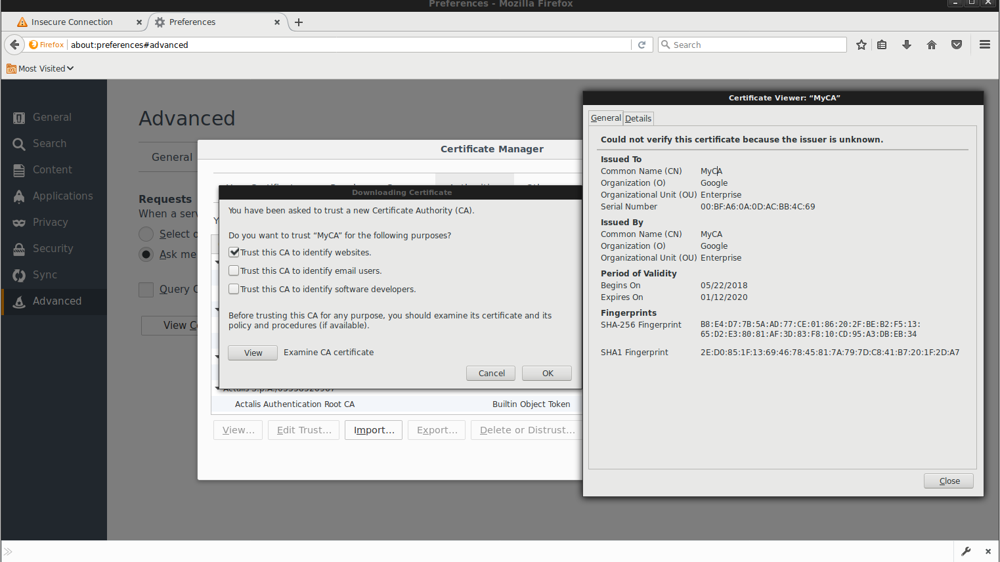
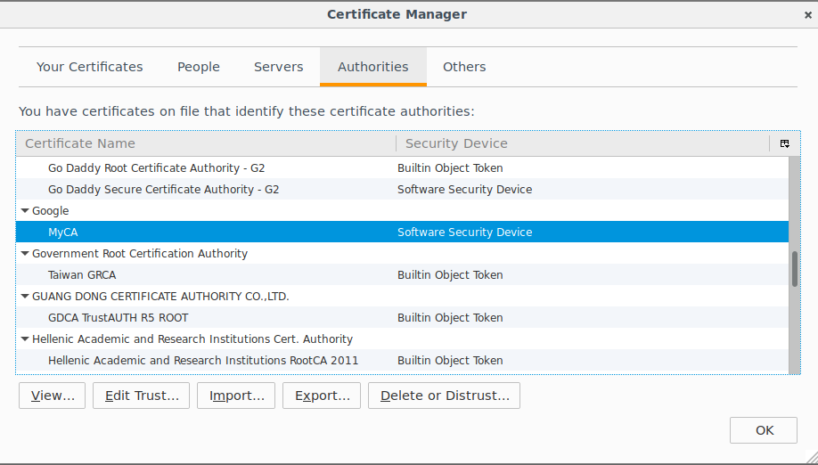
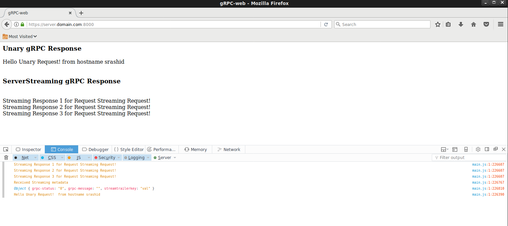

# gRPC-web "helloworld"


Sample application demonstrating [grpc-Web](https://github.com/grpc/grpc-web).

Components used in this sample app:

- gRPC Server (port: `:50051`)
- envoy proxy (port `:8080`)
- nodeJS webserver (port `:8000`)

gRPC calls from the browser communicates with the envoyProxy which inturn talks to the upstream gRPC server

All traffic is over SSL using the provided SSL cert with `CN=server.domain.com`


## Setup

1. Download envoy binary: [https://www.envoyproxy.io/docs/envoy/latest/install/building](https://www.envoyproxy.io/docs/envoy/latest/install/building)
    
2. Install ```golang```, ```nodeJS```

3. Install protoc

    ```bash
    curl -OL https://github.com/google/protobuf/releases/download/v3.2.0/protoc-3.2.0-linux-x86_64.zip
    unzip protoc-3.2.0-linux-x86_64.zip -d protoc3
    sudo mv protoc3/bin/* /usr/local/bin/
    sudo mv protoc3/include/* /usr/local/include/
    ```


4. set hostname

We're doing this for CORS and the provided cert CN/SNI settings

    ```
    /etc/hosts
    127.0.0.1 server.domain.com
    ```

5. build grpcServer

```
    cd app
    export GOPATH=`pwd`

    go get github.com/golang/protobuf/proto \
        golang.org/x/net/context \
        google.golang.org/grpc \
        google.golang.org/grpc/credentials \
        google.golang.org/grpc/health \
        google.golang.org/grpc/health/grpc_health_v1 \
        google.golang.org/grpc/metadata \
        golang.org/x/net/trace \
        golang.org/x/net/http2 \
        golang.org/x/net/http2/hpack

    protoc -I src/ src/echo/echo.proto --go_out=plugins=grpc:src/
```

6.  Run server

- Server
```
    go run src/grpc_server.go  -grpcport server.domain.com:50051
```

- Test Client app

```
    cd app
    export GOPATH=`pwd`
    go run src/grpc_client.go -host server.domain.com:50051
```

7. Generate javascript grpc libraries

```
    cd app

    protoc -I=.  src/echo/echo.proto --js_out=import_style=commonjs:www --proto_path=. --grpc-web_out=import_style=commonjs,mode=grpcwebtext:www
```

8. Create javascript webpack

```
    cd app/www

    npm i
    npx webpack client.js
```

This sample app simply make a static RPC call back in both unary and streaming to envoy and displays the resuts in a `div`:

```javascript
        const {EchoRequest} = require('./src/echo/echo_pb.js');
        const {EchoServerClient} = require('./src/echo/echo_grpc_web_pb.js');

        const grpc = {};
        grpc.web = require('grpc-web');

        var echoService = new EchoServerClient('https://server.domain.com:8080', null, null);

        var unary_request = new EchoRequest();
        unary_request.setName('Unary Request!');

        echoService.sayHello(unary_request, {"custom-header-1": "value1"},  function(err, response) {
            if (err) {
            alert('Error calling gRPC sayHello: '+err.code+' "'+  err.message+'"');
            } else {
            setTimeout(function () {
                console.log(response.getMessage());
                var x = document.getElementById("unary");
                x.innerHTML = response.getMessage();
            }, 500);
        }
        });
```


9. Start Envoy

```
    cd app
    envoy  --log-level debug -c envoy.yaml
```

> Note, envoy uses SSL for both upstream and downsream connecitons: (certs are loaded from the `app/` folder)

10. Start webserver

```
    cd www/

    node_modules/.bin/http-server   -p 8000 -a server.domain.com --ssl --cert ../server_crt.pem --key ../server_key.pem
```

11. Trust `CA_crt.pem` on Browser:

- Firefox:
-    

-    


12. Access the webapp

- [https://server.domain.com:8000/](https://server.domain.com:8000/)

You should see the index page which inturn make gRPC API calls back for unary and streaming requests:

-    

