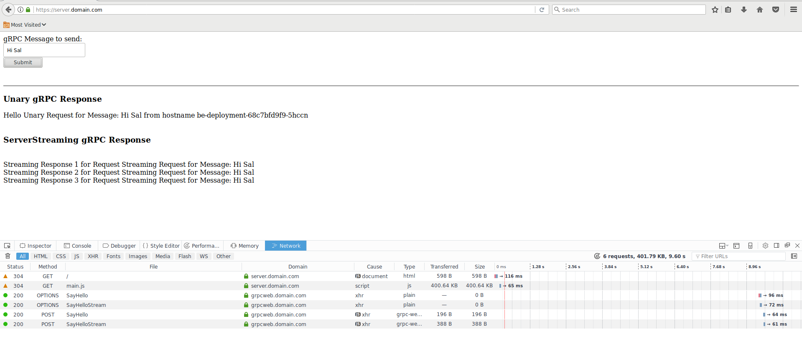

#  gRPC over browser Javascript: Using gRPC-Web on Google Kubernetes Engine Ingress


[grpc-web](https://github.com/grpc/grpc-web) offers a way to access your [gRPC](https://grpc.io/) API server from a modern browser.  Normally, API servers you call directly from browsers is plain `REST`...but its not well known that you can also call gRPC directly without involving [transcoding](https://github.com/grpc-ecosystem/grpc-httpjson-transcoding) or REST but a modification of the standard gRPC wire protocol adapted to account for browser limitations.  

So last wee i wanted to create a simple helloworld app for grpcWeb and succeded in doing that direclty on my laptop (you can see that sample [here](https://github.com/salrashid123/gcegrpc/tree/master/grpc-web).  As a further extension, I endedup adapting that sample sample to run on GKE direclty with its HTTP/2 Ingress resource capability.  That is, this sample deploys a simple webapp which from the browser calls a gRPC server!

The basic flow for this app would be:

1. browser requests a plain HTML page from a webserver on GKE (externally exposed via Ingress)
2. webserver responds back with html page including some javascript w/ grpc Client code
4. browser then issues grpc-web API call to the same Ingress endpoint but routed towards an Envoy proxy backend
5. envoy forwards gRPC request to your backend gRPC server over true `grpc://`
6. backend API responds back to request with unary or streamed response.

As a bonus, this sample also exposes the gRPC server's port directly.  This allows ordinary gRPC clients written in any language to connect and issue API requests.

- 

You can read more about gRPC and gRPC-web in the references cited below.

## gRPC Transcoding vs gRPC Web vs gRPC Native

gRPC web should not be confused with gRPC Transcoding:  the former is a modification of gRPC protocol adapted for a browser (i.,e try to use `application/grpc` framing and separate out the `HTTP/2` framing not exposed to browsers).  Transcoding is a server-side capability that converts an inbound REST message into a backend gRPC request.

For more information, see [Protocol differences vs gRPC over HTTP2](https://github.com/grpc/grpc/blob/master/doc/PROTOCOL-WEB.md#protocol-differences-vs-grpc-over-http2)


Google Cloud Enpoints supports this type of transcoding via annotations as described here
 -[https://cloud.google.com/endpoints/docs/grpc/about-grpc](https://cloud.google.com/endpoints/docs/grpc/about-grpc)
 -[https://cloud.google.com/endpoints/docs/grpc/transcoding](https://cloud.google.com/endpoints/docs/grpc/transcoding)

Here is an example hello-world app for gRPCTranscoding using Cloud Endpoints
- [Google Cloud Endpoints: REST and gRPC, gRPC+Transcoding](https://github.com/salrashid123/esp_docker)


## Cloud Endpoints support for gRPC-Web
 
  The example in this repo utilizes Envoy.  You can also use Google Cloud Endpoint's ESP proxy which provides basic grpc-web support in addition to other features/capabilities of Endpoints like API management.

- [https://github.com/cloudendpoints/esp/blob/master/CHANGELOG.md#release-1100-24-10-2017](https://github.com/cloudendpoints/esp/blob/master/CHANGELOG.md#release-1100-24-10-2017)


## Setup


### Allocate StaticIP 
 
 This step isn't necessary but use statically bound the name `gke-ingress` to the Ingress objects later

```
gcloud compute addresses create gke-ingress --global

gcloud compute addresses list
NAME         REGION  ADDRESS        STATUS
gke-ingress          35.241.41.138  RESERVED
```

### Edit /etc/hosts

Since this is just a demo/POC, statically set the IP to resolve to `.domain.com` as shown below

```
/etc/hosts
35.241.41.138 server.domain.com grpcweb.domain.com grpc.domain.com
```


### Create the GKE cluster

```
gcloud container  clusters create grpc-cluster --machine-type "n1-standard-1" --cluster-version=1.10.5 --zone us-central1-a  --num-nodes 3
```


### Build Components

You can either build ad upload the images to dockerhub or to your own Container Registry (`gcr.io/project...`).

If you choose to use the images I created and uploaded, skip this section to the "Deploy" part.


#### gRPC Backend

The gRPC backend is a golang app that simply Echo's back a message as Unary or Server Streaming (i.,e echo back the message three times).

There is the proto:

```
syntax = "proto3";

package echo;

service EchoServer {
  rpc SayHello (EchoRequest) returns (EchoReply) {}
  rpc SayHelloStream(EchoRequest) returns (stream EchoReply) {}  
}

message EchoRequest {
  string name = 1;
}

message EchoReply {
  string message = 1;
}
```


You can either build the backend or use the one I uploaded here:

- `docker.io/salrashid123/grpc_backend`

To build, simply run the following and upload

```
cd backend_grpc
docker build -t your_registry/grpc_backend .
```

The grpc_backend listens on port `:50051` so to run it localy, execute something like:

```
 docker run  -p 50051:50051 -t salrashid123/grpc_backend ./grpc_server -grpcport 0.0.0.0:50051
```

You can even test the grpc Client locally by running

```
docker run --net=host --add-host grpc.domain.com:127.0.0.1 -t salrashid123/grpc_backend /grpc_client --host grpc.domain.com:50051
```

#### Frontend

You can either build the backend or use the one I uploaded here

- `docker.io/salrashid123/web_frontend`

```
cd frontend
docker build -t your_registry/web_frontend .
```

The frontend listens on port `:8000` so to run it localy, execute something like:

```
docker run -p 8000:8000 salrashid123/web_frontend
```

#### Envoy

You can either build the envoyproxy container or use the one I uploaded here

- `docker.io/salrashid123/grpc_envoyproxy`

```
cd grpc_web_with_gke/backend_envoy
docker build -t your_registry/grpc_envoyproxy .
```

The grpc_proxy listens on port `:18080`. You can run it locally within a docker file but you'll need to network it with a backend to use it easily.


## Deploy


If you choose to use the images I uploaded, just run:

```
cd grpc_web_with_gke/gke_config
$ kubectl apply -f .
```

Otherwise, edit each yaml file under `gke_config/` folder and change the image reference to your registry.


Once you deploy, you should see the deploymets and the staticIP attached to the Ingress object:

```bash
$ kubectl get no,po,rc,svc,ing,deployments,secrets
NAME                                             STATUS    ROLES     AGE       VERSION
no/gke-grpc-cluster-default-pool-20747835-3sw8   Ready     <none>    11h       v1.10.5-gke.4
no/gke-grpc-cluster-default-pool-20747835-s0z3   Ready     <none>    11h       v1.10.5-gke.4

NAME                                READY     STATUS    RESTARTS   AGE
po/be-deployment-75978bd8bf-bn5fp   2/2       Running   0          2m
po/be-deployment-75978bd8bf-k5x6b   2/2       Running   0          2m
po/fe-deployment-574d47d8c-lktkm    1/1       Running   0          2m
po/fe-deployment-574d47d8c-x4w8z    1/1       Running   0          1m

NAME              TYPE        CLUSTER-IP      EXTERNAL-IP   PORT(S)           AGE
svc/be-srv        NodePort    10.19.251.246   <none>        18080:31592/TCP   9h
svc/be-srv-grpc   NodePort    10.19.240.140   <none>        50051:31610/TCP   9h
svc/fe-srv        NodePort    10.19.247.166   <none>        8000:31713/TCP    9h
svc/kubernetes    ClusterIP   10.19.240.1     <none>        443/TCP           11h

NAME                HOSTS                                                  ADDRESS         PORTS     AGE
ing/basic-ingress   server.domain.com,grpcweb.domain.com,grpc.domain.com   35.241.41.138   80, 443   9h

NAME                   DESIRED   CURRENT   UP-TO-DATE   AVAILABLE   AGE
deploy/be-deployment   2         2         2            2           9h
deploy/fe-deployment   2         2         2            2           9h

NAME                          TYPE                                  DATA      AGE
secrets/default-token-v958b   kubernetes.io/service-account-token   3         11h
secrets/fe-secret             Opaque                                2         9h
```

> *NOTE:* Deployment and availability of the endpoint IP may take `8->10minutes`

## Browser

Trust the `CA_crt.pem` file in Firefox since its self-singed.  Open up `Firefox` and under the Advanced settings, enable trust for the CA (you don't have to but its easier this way)

- 


Now go to `https://server.domain.com/`.  You should see the nodejs Frontend,  You may wan to open up developer tools to see the request/response streams

Click the `Submit` button.  WHat that will do is transmit 1 unary request and 1 server-streaming request.  The unary request will respond back with the hostname that handled the request.   Below that you should see three RPC responses back from the server request.

Here is a sample Request-Response from the browser

- Request
```
Host: grpcweb.domain.com
User-Agent: Mozilla/5.0 (X11; Linux x86_64; rv:52.0) Gecko/20100101 Firefox/52.0
Accept: application/grpc-web-text
Accept-Language: en-US,en;q=0.5
Accept-Encoding: gzip, deflate, br
Referer: https://server.domain.com/
custom-header-1: value1
Content-Type: application/grpc-web-text
X-User-Agent: grpc-web-javascript/0.1
X-Grpc-Web: 1
Content-Length: 56
Origin: https://server.domain.com
Connection: keep-alive
```

- Response
```
Access-Control-Allow-Origin: https://server.domain.com
Alt-Svc: clear
Content-Type: application/grpc-web-text+proto
Date: Mon, 03 Sep 2018 18:04:28 GMT
Server: envoy
Via: 1.1 google
X-Firefox-Spdy: h2
access-control-expose-headers: custom-header-1,grpc-status,grpc-message
rpcheaderkey: val
x-envoy-upstream-service-time: 0
```

- 


## gRPC Client

The setup here also enables direct gRPC client calls outside of a browser.  This means you can use any gRPC client directly.  In the example below, we are using a golang gRPC client (remember to change the IP address to your Ingress's IP before invoking)

```
$ docker run --add-host grpc.domain.com:35.241.41.138  -t gcr.io/mineral-minutia-820/grpc_backend /grpc_client --host grpc.domain.com:443
2018/09/03 15:55:33 RPC Response: 0 message:"Hello unary RPC msg   from hostname be-deployment-68c7bfd9f9-5hccn" 
2018/09/03 15:55:34 RPC Response: 1 message:"Hello unary RPC msg   from hostname be-deployment-68c7bfd9f9-5hccn" 
2018/09/03 15:55:35 RPC Response: 2 message:"Hello unary RPC msg   from hostname be-deployment-68c7bfd9f9-c7fth" 
2018/09/03 15:55:36 RPC Response: 3 message:"Hello unary RPC msg   from hostname be-deployment-68c7bfd9f9-c7fth" 
2018/09/03 15:55:37 RPC Response: 4 message:"Hello unary RPC msg   from hostname be-deployment-68c7bfd9f9-c7fth" 
2018/09/03 15:55:38 RPC Response: 5 message:"Hello unary RPC msg   from hostname be-deployment-68c7bfd9f9-5hccn" 
2018/09/03 15:55:39 RPC Response: 6 message:"Hello unary RPC msg   from hostname be-deployment-68c7bfd9f9-5hccn" 
```

The response shows the backends that handled each request.  Note that the responses are from different backends over a *single* connection.  THis is as expected since the GCP L7 loadbalancer (Ingress), send each RPC to different pods to balance loads.

## Conclusion

`gRPC-web` and `gRPC` offers many advantages to API developers thats inherent in the protocol and toolchains.  Before you jump in, please read through what you actually need/want from your API and clients.  Often enough, for low-intensity APIs or simple clients, `REST` is a perfectly fine to use (easy to use, easy to setup; widespread support, etc)...it just depends on your current and future needs.

Anyway, hope this article helps bridge some the gaps and shows how you can use `grpc-web` on GKE.  You ofcourse do not need to use GKE...take a look at the examples in the reference section below to get started locally or on any platform.

