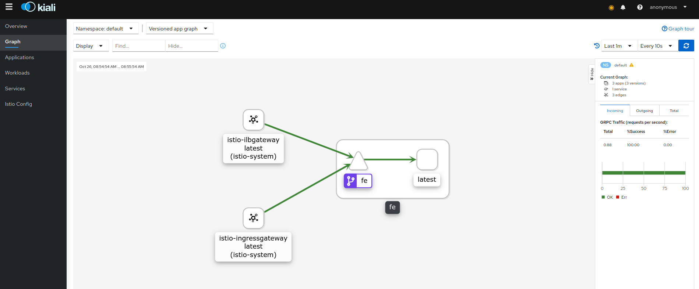

# Istio gRPC Loadbalancing with GCP Internal LoadBalancer (ILB)


Demonstrates gRPC loadbalancing with Istio where mesh-external clients connect via GCP external and internal LoadBalancers:

- `client_grpc_app (on GCEVM) --> (GCP ILB) --> Istio --> Service`

- `client_grpc_app (external) --> (GCP ExternalLB) --> Istio --> Service`


- uses ISTIO version `1.8.1`

1) Install GKE+Istio

```bash
gcloud container  clusters create istio-1 --machine-type "n1-standard-2" --zone us-central1-a  --num-nodes 4 \
   --enable-ip-alias  -q

gcloud container clusters get-credentials istio-1 --zone us-central1-a

kubectl create clusterrolebinding cluster-admin-binding --clusterrole=cluster-admin --user=$(gcloud config get-value core/account)

kubectl create ns istio-system

export ISTIO_VERSION=1.21.0

wget -P /tmp/ https://github.com/istio/istio/releases/download/$ISTIO_VERSION/istio-$ISTIO_VERSION-linux-amd64.tar.gz
tar xvf /tmp/istio-$ISTIO_VERSION-linux-amd64.tar.gz -C /tmp/
rm /tmp/istio-$ISTIO_VERSION-linux-amd64.tar.gz

export PATH=/tmp/istio-$ISTIO_VERSION/bin:$PATH

istioctl install --set profile=demo \
 --set meshConfig.enableAutoMtls=true  \
 --set values.gateways.istio-ingressgateway.runAsRoot=true \
 --set meshConfig.outboundTrafficPolicy.mode=REGISTRY_ONLY \
 -f overlay-istio-gateway.yaml

kubectl label namespace default istio-injection=enabled
```


2) Verify external and ILB IP addresses

```bash
kubectl get svc istio-ingressgateway -n istio-system
export GATEWAY_IP=$(kubectl -n istio-system get service istio-ingressgateway -o jsonpath='{.status.loadBalancer.ingress[0].ip}')
echo $GATEWAY_IP

kubectl get svc istio-ilbgateway  -n istio-system
export ILB_GATEWAY_IP=$(kubectl -n istio-system get service istio-ilbgateway -o jsonpath='{.status.loadBalancer.ingress[0].ip}')
echo $ILB_GATEWAY_IP
```

istio deployment

```bash
$ kubectl get no,po,rc,svc,ing,deployment -n istio-system

      NAME                                            STATUS   ROLES    AGE   VERSION
      node/gke-cluster-1-default-pool-39500f93-4w4g   Ready    <none>   32m   v1.18.9-gke.2501
      node/gke-cluster-1-default-pool-39500f93-bsqm   Ready    <none>   32m   v1.18.9-gke.2501
      node/gke-cluster-1-default-pool-39500f93-cq95   Ready    <none>   32m   v1.18.9-gke.2501
      node/gke-cluster-1-default-pool-39500f93-x7f6   Ready    <none>   32m   v1.18.9-gke.2501

      NAME                                        READY   STATUS    RESTARTS   AGE
      pod/istio-egressgateway-7b49cdb77f-4xgl7    1/1     Running   0          10m
      pod/istio-ilbgateway-789d466f67-mkpxr       1/1     Running   0          10m
      pod/istio-ingressgateway-78c9bf4887-m7dhq   1/1     Running   0          10m
      pod/istiod-95bffc969-qx6rd                  1/1     Running   0          11m

      NAME                           TYPE           CLUSTER-IP   EXTERNAL-IP   PORT(S)                                         AGE
      service/istio-egressgateway    ClusterIP      10.4.10.69   <none>        80/TCP,443/TCP,15443/TCP                        10m
      service/istio-ilbgateway       LoadBalancer   10.4.5.41    10.128.0.47   443:31057/TCP                                   10m
      service/istio-ingressgateway   LoadBalancer   10.4.1.151   34.66.87.2    443:31310/TCP                                   10m
      service/istiod                 ClusterIP      10.4.7.159   <none>        15010/TCP,15012/TCP,443/TCP,15014/TCP,853/TCP   11m

      NAME                                   READY   UP-TO-DATE   AVAILABLE   AGE
      deployment.apps/istio-egressgateway    1/1     1            1           10m
      deployment.apps/istio-ilbgateway       1/1     1            1           10m
      deployment.apps/istio-ingressgateway   1/1     1            1           10m
      deployment.apps/istiod                 1/1     1            1           11m
```

3) Deploy sample application

Source code for the sample application is in the `apps/` folder for this repo.

The grpc application creates one gRPC Channel to the server and on that one connection, sends 10 RPC requests.

```bash
kubectl apply -f fe-certs.yaml

kubectl apply -f all-istio.yaml 

kubectl apply -f istio-fe.yaml \
   -f istio-ingress-ilbgateway.yaml \
    -f istio-ingress-gateway.yaml

# regenerate the ingress-gateway to pickup the certs
INGRESS_POD_NAME=$(kubectl get po -n istio-system | grep ingressgateway\- | awk '{print$1}'); echo ${INGRESS_POD_NAME};
kubectl delete po/$INGRESS_POD_NAME -n istio-system

ILB_INGRESS_POD_NAME=$(kubectl get po -n istio-system | grep ilbgateway\- | awk '{print$1}'); echo ${INGRESS_POD_ILB_INGRESS_POD_NAMENAME};
kubectl delete po/$ILB_INGRESS_POD_NAME -n istio-system
```

After sometime, you should see

```bash
$ kubectl get po,rc,svc,ing,deployment 

   NAME                                 READY   STATUS    RESTARTS   AGE
   pod/fe-deployment-587d46d8c7-526xt   2/2     Running   0          56s
   pod/fe-deployment-587d46d8c7-k4b4q   2/2     Running   0          56s
   pod/fe-deployment-587d46d8c7-ptzbt   2/2     Running   0          56s
   pod/fe-deployment-587d46d8c7-sjj56   2/2     Running   0          56s

   NAME                 TYPE        CLUSTER-IP    EXTERNAL-IP   PORT(S)   AGE
   service/fe           ClusterIP   10.4.14.180   <none>        443/TCP   57s
   service/kubernetes   ClusterIP   10.4.0.1      <none>        443/TCP   29m

   NAME                            READY   UP-TO-DATE   AVAILABLE   AGE
   deployment.apps/fe-deployment   4/4     4            4           57s

```

as well as the serivce on GKE console


### Verify External client connectivity

wait about 10mins (really, you need to wait)
```bash
docker  run --add-host grpc.domain.com:$GATEWAY_IP -t salrashid123/grpc_backend /grpc_client --host grpc.domain.com:443
```

You should see responses from different service addresses:

```bash
$ docker  run --add-host grpc.domain.com:$GATEWAY_IP -t salrashid123/grpc_backend /grpc_client --host grpc.domain.com:443

2020/10/26 12:51:14 RPC Response: 0 message:"Hello unary RPC msg   from hostname fe-deployment-587d46d8c7-526xt" 
2020/10/26 12:51:15 RPC Response: 1 message:"Hello unary RPC msg   from hostname fe-deployment-587d46d8c7-sjj56" 
2020/10/26 12:51:16 RPC Response: 2 message:"Hello unary RPC msg   from hostname fe-deployment-587d46d8c7-k4b4q" 
2020/10/26 12:51:17 RPC Response: 3 message:"Hello unary RPC msg   from hostname fe-deployment-587d46d8c7-ptzbt" 
2020/10/26 12:51:18 RPC Response: 4 message:"Hello unary RPC msg   from hostname fe-deployment-587d46d8c7-526xt" 
2020/10/26 12:51:20 RPC Response: 5 message:"Hello unary RPC msg   from hostname fe-deployment-587d46d8c7-sjj56" 
2020/10/26 12:51:21 RPC Response: 6 message:"Hello unary RPC msg   from hostname fe-deployment-587d46d8c7-k4b4q" 
2020/10/26 12:51:22 RPC Response: 7 message:"Hello unary RPC msg   from hostname fe-deployment-587d46d8c7-ptzbt" 
2020/10/26 12:51:23 RPC Response: 8 message:"Hello unary RPC msg   from hostname fe-deployment-587d46d8c7-526xt" 
2020/10/26 12:51:24 RPC Response: 9 message:"Hello unary RPC msg   from hostname fe-deployment-587d46d8c7-sjj56"
```

### Verify Internal client connectivity

First create a GCP VM within the same VPC.  SSH in and run:
  
```bash
  docker  run --add-host grpc.domain.com:$ILB_GATEWAY_IP  -t salrashid123/grpc_backend /grpc_client --host grpc.domain.com:443 
```

You should see responses from different service addresses:

```bash
$  docker  run --add-host grpc.domain.com:$ILB_GATEWAY_IP -t salrashid123/grpc_backend /grpc_client --host grpc.domain.com:443

2020/10/26 12:51:04 RPC Response: 0 message:"Hello unary RPC msg   from hostname fe-deployment-587d46d8c7-sjj56" 
2020/10/26 12:51:05 RPC Response: 1 message:"Hello unary RPC msg   from hostname fe-deployment-587d46d8c7-k4b4q" 
2020/10/26 12:51:06 RPC Response: 2 message:"Hello unary RPC msg   from hostname fe-deployment-587d46d8c7-ptzbt" 
2020/10/26 12:51:07 RPC Response: 3 message:"Hello unary RPC msg   from hostname fe-deployment-587d46d8c7-526xt" 
2020/10/26 12:51:08 RPC Response: 4 message:"Hello unary RPC msg   from hostname fe-deployment-587d46d8c7-sjj56" 
2020/10/26 12:51:09 RPC Response: 5 message:"Hello unary RPC msg   from hostname fe-deployment-587d46d8c7-k4b4q" 
2020/10/26 12:51:10 RPC Response: 6 message:"Hello unary RPC msg   from hostname fe-deployment-587d46d8c7-ptzbt" 
2020/10/26 12:51:11 RPC Response: 7 message:"Hello unary RPC msg   from hostname fe-deployment-587d46d8c7-526xt" 
2020/10/26 12:51:12 RPC Response: 8 message:"Hello unary RPC msg   from hostname fe-deployment-587d46d8c7-sjj56" 
2020/10/26 12:51:13 RPC Response: 9 message:"Hello unary RPC msg   from hostname fe-deployment-587d46d8c7-k4b4q"
```

If you want to see this visually, setup `Kiali`, you should see traffic inbound from the ILB and external gateway:

first go to the UI
```
kubectl apply -f https://raw.githubusercontent.com/istio/istio/release-1.7/samples/addons/prometheus.yaml
sleep 10
kubectl apply -f https://raw.githubusercontent.com/istio/istio/release-1.7/samples/addons/kiali.yaml
sleep 10
kubectl -n istio-system port-forward $(kubectl -n istio-system get pod -l app=kiali -o jsonpath='{.items[0].metadata.name}') 20001:20001
```
then in a browser go to

* Kiali http://localhost:20001/kiali (username: admin, password: admin)



